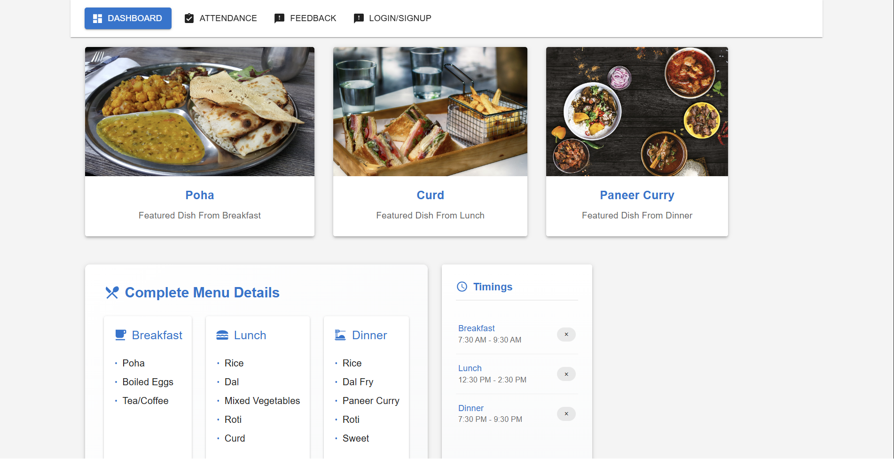

# Mess Management System

A comprehensive web application for managing college/institution mess operations, providing an efficient solution for menu management, attendance tracking, and feedback collection.

## 🚀 Features

### 📊 Interactive Dashboard
- **Dynamic Menu Display**
  - Real-time updates of daily meals
  - Visual representations with food images via Pixabay API
  - Organized display of breakfast, lunch, and dinner items
  - Hover effects and smooth animations

- **Meal Timing Management**
  - Clear display of meal schedules
  - Real-time status indicators
  - Interactive timeline view
  - Attendance status integration

### 👥 Attendance System
- **Secure Admin Access**
  - Protected route with password authentication
  - Admin dashboard for attendance management
  - **Admin Login Credentials:**
    - Password: `iamadmin`
    - No username required
    - Auto-redirects to dashboard after successful login

- **Student Management**
  - Handles up to 50 students per page
  - Pagination and sorting capabilities
  - Room number and roll number tracking
  - Individual meal attendance marking

## 🔐 Admin Access
To access the attendance management system:
1. Click on "Attendance" in the navigation bar
2. Enter the admin password: `iamadmin`
3. Click "Login" to access the attendance dashboard
4. Use "Cancel" to return to the main dashboard

Note: The admin password is hardcoded for demonstration purposes. In a production environment, this should be managed through a secure authentication system.

### 📝 Feedback System
- **Comprehensive Feedback Collection**
  - Meal-specific ratings
  - Star-based rating system
  - Detailed comment sections
  - Suggestion box for improvements

## 🛠️ Technical Stack

### Frontend
- **React.js (v18+)**
  - Modern functional components
  - Custom hooks for data fetching
  - Context API for state management
  - React Router v6 for navigation

- **Material-UI (MUI v5)**
  - Responsive grid system
  - Custom theme implementation
  - Advanced components
  - Custom styling with emotion

- **Additional Libraries**
  - Axios for API requests
  - React Icons for custom icons
  - Day.js for date handling
  - React Hook Form for form validation

### State Management
- Context API implementation
- Custom hooks for shared logic
- Local storage persistence
- Real-time state updates

### APIs & Integration
- **Pixabay API Integration**
  - Dynamic food image fetching
  - Error handling
  - Image caching
  - Fallback images

- **Random User API**
  - Student data generation
  - Custom data transformation
  - Error boundary implementation
  - Data caching

## 🚀 Deployment

### Netlify Deployment
```toml
[build]
  command = "npm run build"
  publish = "build"
  node_version = "16"

[[redirects]]
  from = "/*"
  to = "/index.html"
  status = 200

[build.environment]
  GENERATE_SOURCEMAP = "false"
  VITE_PIXABAY_API_KEY = "your_api_key"
```

### Environment Setup
1. Create `.env` files:
```bash
# .env.development
VITE_PIXABAY_API_KEY=your_development_key
VITE_API_URL=http://localhost:3000

# .env.production
VITE_PIXABAY_API_KEY=your_production_key
VITE_API_URL=https://api.yoursite.com
```

2. Netlify CLI Setup:
```bash
npm install netlify-cli -g
netlify login
netlify init
```

### CI/CD Pipeline
1. GitHub Actions Integration
2. Automated testing
3. Build optimization
4. Environment variable management

## 📥 Installation

1. Clone the repository:
```bash
git clone https://github.com/yourusername/Mess-Management-App.git
```

2. Navigate to project directory:
```bash
cd Mess-Management-App
```

3. Install dependencies:
```bash
npm install
```

4. Create .env file:
```env
VITE_PIXABAY_API_KEY=your_pixabay_api_key
```

5. Start development server:
```bash
npm run dev
```

## 📸 Screenshots

### Dashboard View
<div align="center">
  
  <p><em>Interactive dashboard showing daily menu and meal timings</em></p>
</div>

### Attendance Management
<div align="center">
  
  <p><em>Secure admin login interface</em></p>
</div>
<div align="center">
  
  <p><em>Student attendance tracking system</em></p>
</div>

### Feedback Interface
<div align="center">
  
  <p><em>User-friendly feedback collection form</em></p>
</div>

## 📦 Project Structure

## 🚀 Deployment

### Step 1: Prepare Your Project
1. Ensure your project builds successfully locally:
```bash
npm run build
```

### Step 2: Create Netlify Account
1. Go to [Netlify](https://www.netlify.com/)
2. Sign up or login with your GitHub account

### Step 3: Configure Build Settings
1. Click "New site from Git"
2. Choose GitHub as your Git provider
3. Select your repository
4. Configure build settings:
   - Build command: `npm run build`
   - Publish directory: `dist`
   - Node version: `16`

### Step 4: Environment Variables
Add these environment variables in Netlify settings:
```env
VITE_PIXABAY_API_KEY=your_pixabay_api_key
```

### Step 5: Deploy Configuration
Create `netlify.toml` in your project root:
```toml
[build]
  command = "npm run build"
  publish = "dist"
  node_version = "16"

[[redirects]]
  from = "/*"
  to = "/index.html"
  status = 200

[build.environment]
  GENERATE_SOURCEMAP = "false"
```

### Step 6: Automatic Deployments
1. Enable automatic deployments in Netlify settings
2. Configure branch to deploy: `main`
3. Set up build hooks (optional)

### Deployment URL
Your site will be available at: `https://your-site-name.netlify.app`

### Troubleshooting
- Check build logs in Netlify dashboard
- Verify environment variables
- Ensure all dependencies are listed in package.json
- Check for build errors in local environment
